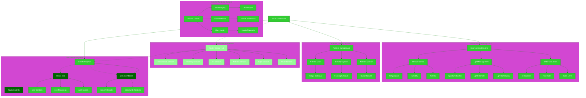

```mermaid
%%{init: {'theme': 'base', 'themeVariables': { 'primaryColor': '#32CD32', 'primaryTextColor': '#fff', 'primaryBorderColor': '#1a8917', 'lineColor': '#1a8917', 'secondaryColor': '#006400'}}}%%

graph TB
    classDef mainSystem fill:#32CD32,stroke:#1a8917,stroke-width:2px,color:#fff
    classDef subSystem fill:#90EE90,stroke:#32CD32,stroke-width:2px
    classDef sensor fill:#98FB98,stroke:#32CD32
    classDef userInterface fill:#006400,stroke:#004d00,color:#fff
    classDef dataFlow fill:#E0FFFF,stroke:#87CEEB
    
    %% Main Control System
    MainControl[Smart Control Hub]:::mainSystem
    MainControl --> Environment[Environmental Control]
    MainControl --> Nutrients[Nutrient Management]
    MainControl --> Analytics[Growth Analytics]
    
    %% Environmental Control Subsystem
    subgraph EnvironmentSystem[Environmental Management]
        Environment --> Climate[Climate Control]
        Environment --> Light[Light Management]
        Environment --> Water[Water Circulation]
        
        %% Climate Control Details
        Climate --> Temp[Temperature]
        Climate --> Humid[Humidity]
        Climate --> Air[Air Flow]
        
        %% Light Management Details
        Light --> Spectrum[Spectrum Control]
        Light --> Intensity[Light Intensity]
        Light --> Timing[Light Scheduling]
        
        %% Water System Details
        Water --> pH[pH Balance]
        Water --> Flow[Flow Rate]
        Water --> Level[Water Level]
    end
    
    %% Nutrient Management Subsystem
    subgraph NutrientSystem[Nutrient Delivery System]
        Nutrients --> Mix[Nutrient Mixer]
        Nutrients --> Delivery[Delivery System]
        Nutrients --> Monitor[Nutrient Monitor]
        
        Mix --> Recipe[Recipe Database]
        Delivery --> Schedule[Feeding Schedule]
        Monitor --> Levels[Nutrient Levels]
    end
    
    %% Sensor Network
    subgraph SensorNetwork[Smart Sensor Network]
        Sensors[Master Sensor Hub]:::sensor
        Sensors --> TempSensor[Temperature Sensors]:::sensor
        Sensors --> HumidSensor[Humidity Sensors]:::sensor
        Sensors --> pHSensor[pH Sensors]:::sensor
        Sensors --> NutriSensor[Nutrient Sensors]:::sensor
        Sensors --> LightSensor[Light Sensors]:::sensor
        Sensors --> WaterSensor[Water Sensors]:::sensor
    end
    
    %% User Interface
    subgraph Interface[User Interface System]
        App[Mobile App]:::userInterface
        Dashboard[Web Dashboard]:::userInterface
        Controls[Touch Controls]:::userInterface
        
        App --> UserControls[User Controls]
        App --> Monitoring[Live Monitoring]
        App --> Alerts[Alert System]
        
        Dashboard --> Analytics
        Dashboard --> Reports[Growth Reports]
        Dashboard --> Community[Community Features]
    end
    
    %% Data Flow
    MainControl -.-> Sensors
    Sensors -.-> Analytics
    Analytics -.-> App
    Analytics -.-> Dashboard
    
    %% Plant Growth Tracking
    subgraph GrowthTracking[Growth Monitoring System]
        Track[Growth Tracker]
        Track --> Images[Plant Imaging]
        Track --> Growth[Growth Metrics]
        Track --> Health[Plant Health]
        
        Images --> ML[ML Analysis]
        Growth --> Predict[Growth Predictions]
        Health --> Diagnosis[Health Diagnosis]
    end
```
