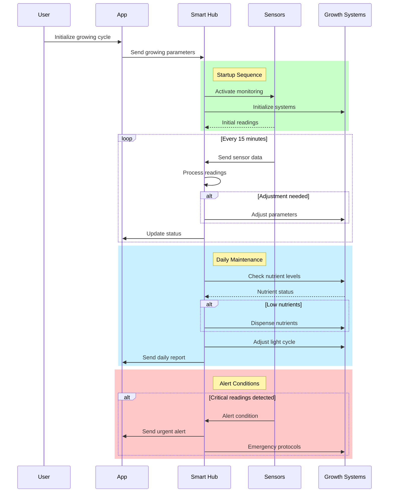

```mermaid

sequenceDiagram
    participant User
    participant App
    participant Hub as Smart Hub
    participant Sensors
    participant Systems as Growth Systems
    
    User->>App: Initialize growing cycle
    App->>Hub: Send growing parameters
    
    rect rgb(200, 255, 200)
    note right of Hub: Startup Sequence
    Hub->>Sensors: Activate monitoring
    Hub->>Systems: Initialize systems
    Sensors-->>Hub: Initial readings
    end
    
    loop Every 15 minutes
        Sensors->>Hub: Send sensor data
        Hub->>Hub: Process readings
        alt Adjustment needed
            Hub->>Systems: Adjust parameters
        end
        Hub->>App: Update status
    end
    
    rect rgb(200, 240, 255)
    note right of Hub: Daily Maintenance
    Hub->>Systems: Check nutrient levels
    Systems-->>Hub: Nutrient status
    alt Low nutrients
        Hub->>Systems: Dispense nutrients
    end
    Hub->>Systems: Adjust light cycle
    Hub->>App: Send daily report
    end
    
    rect rgb(255, 200, 200)
    note right of Hub: Alert Conditions
    alt Critical readings detected
        Sensors->>Hub: Alert condition
        Hub->>App: Send urgent alert
        Hub->>Systems: Emergency protocols
    end
    end

``` 